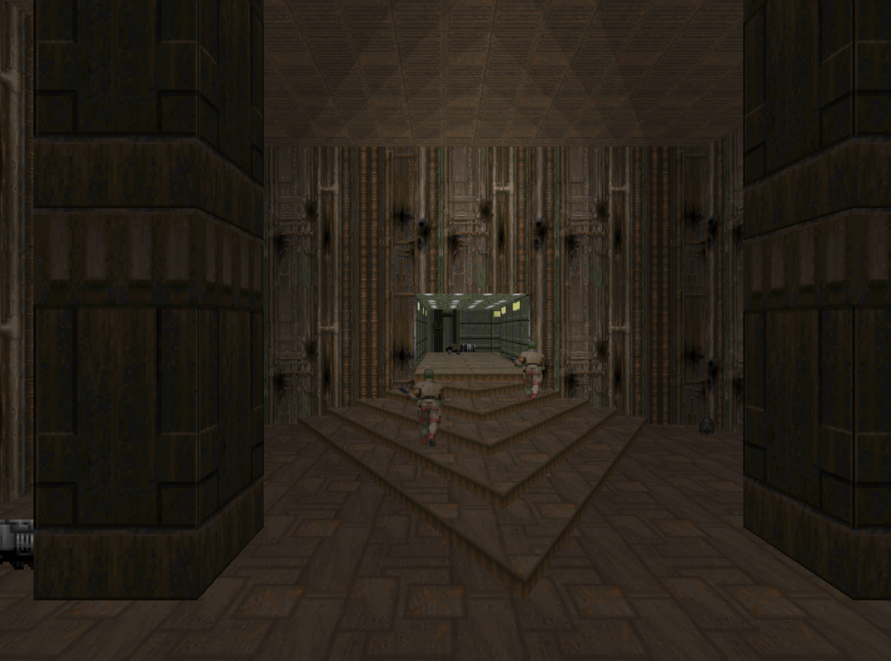

# Doom Renderer in Rust

The purpose of this project was to learn rust by doing something fun like implementing the doom renderer. Although there are many ways a doom level can be rendered, the focus has been on doing it the doom way.




# How to run it

You will need one of the doom wads. By default, the renderer opens the Doom 1 shareware `doom1.wad`. You can pass a path to an alternate one with `--wad`.

Run Doom 1 e1m1 using the shareware `doom1.wad`:
```
cargo run -r
```

Run Doom 1 e1m2 using the shareware `doom1.wad`:
```
cargo run -r --map e1m2
```

Run Doom 1 e2m1 using the commercial `doom.wad`:
```
cargo run -r -- --wad doom.wad --map e2m1
```

Run Doom 2 map01:
```
cargo run -r -- --wad doom2.wad --map map01
```

For more options, see:
```
cargo run -r -- --help
```

# Features
- Solid & semi-transparent walls
- Floors/ceiling + sky
- Things (aka map objects)
- Sector lighting
- Light diminishing
- Blinking lights
- Animated floors
- Map object thinkers state machine - provides animations
- 2D map
- Moving around with keyboard: arrows, shift, strafe, turbo

# Things missing from the renderer
- Animated wall textures

# Links
- [Game Engine Black Book: DOOM](https://archive.org/details/gebbdoome)
- [The Doom wiki](https://doomwiki.org/wiki/Entryway)
    - [Doom rendering engine](https://doomwiki.org/wiki/Doom_rendering_engine)
    - [WAD](https://doomwiki.org/wiki/WAD)
- [The unofficial Doom specs](https://www.gamers.org/dhs/helpdocs/dmsp1666.html)
